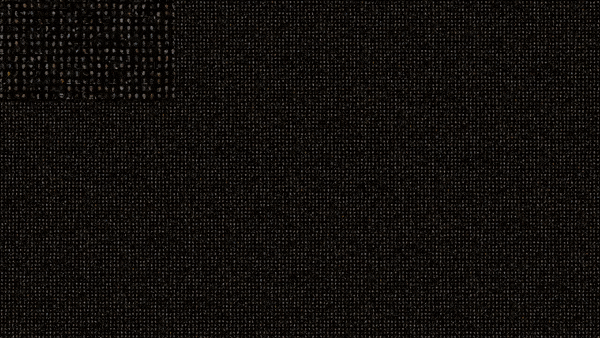

#### Demo
</a>
#### Photo Mosaic
[Photomosaic](https://en.wikipedia.org/wiki/Photographic_mosaic), is a picture (usually a photograph) that has been divided into (usually equal sized) tiled sections, each of which is replaced with another photograph that matches the target photo. When viewed at low magnifications, the individual pixels appear as the primary image, while close examination reveals that the image is in fact made up of many hundreds or thousands of smaller images

#### [Video Mosaic](https://colab.research.google.com/github/vishnu-chand/videoMosaic/blob/main/videoMosaic.ipynb)
on the other hand Video Mosaic is simple applying photo mosaic on every frame and ensuring frame consistency  

#### Challenges 
* lets say 
     - image dimension is 720x1280, total frames in video is 1174
     - tile size 32x32
     - number of tile images in tileGallery ~ 200000
* for better visual quality video is scaled up by 4 times and hence the image dimension translate to 2880x5120
* as we are using 32x32 tiles, total grids in single image will be 2880/32x5120/32=14400 grids
* the video of 1175 frames will have 14400x1175=16920000 grids
* all 16920000 grids will replaced by images from tileGallery
* even if we optimally assume, matching one grid with tile image takes ~ 1 ms
    - this will take 0.001x16920000=16920seconds
    - which translate to ~5 hours to complete a video of less than a minute
#### Algo
* using multiple clustering, dimensionality reduction, activity detection technique total execution time is reduced to ~300 seconds or 4 fps

color feature
* A Tile image is 32x32x3=3072 dimensional vector, we can reduce the dimension using color histogram
* the feature vector color histogram is kept at 125 dimensions

creating tiles
* step1: resize all images tile size eg: 32*32
* step2: calculate 125 dim color histogram feature vector of every image
* step3: using k-means clustering algo, group similar images based on the color feature
* step4: based on population percentile, delete small clusters, this will avoid repeated tiles

photo mosaic
* step1: scale up image to 4x
* step2: split images in 32x32 grids and take color histogram of the grid
* step3: run k-means clustering on grids and group grids into 150 clusters based on color similarity
* step4: map grid cluster to tile cluster based on cosine similarity
* step5: replace images grid with matched tile cluster to create photo mosaic
* step 6: as a final touch up superimpose tiles with image this make global patterns much more visible
video mosaic
* step1: compute euclidean distance between previous and current frame
* step2: if distance is less than certain threshold then re-use previous tiles 
* step3: for the pixels with does not matches with previous frame, compute cluster match as in photo mosaic
